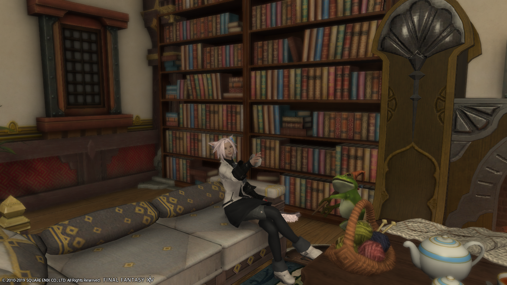
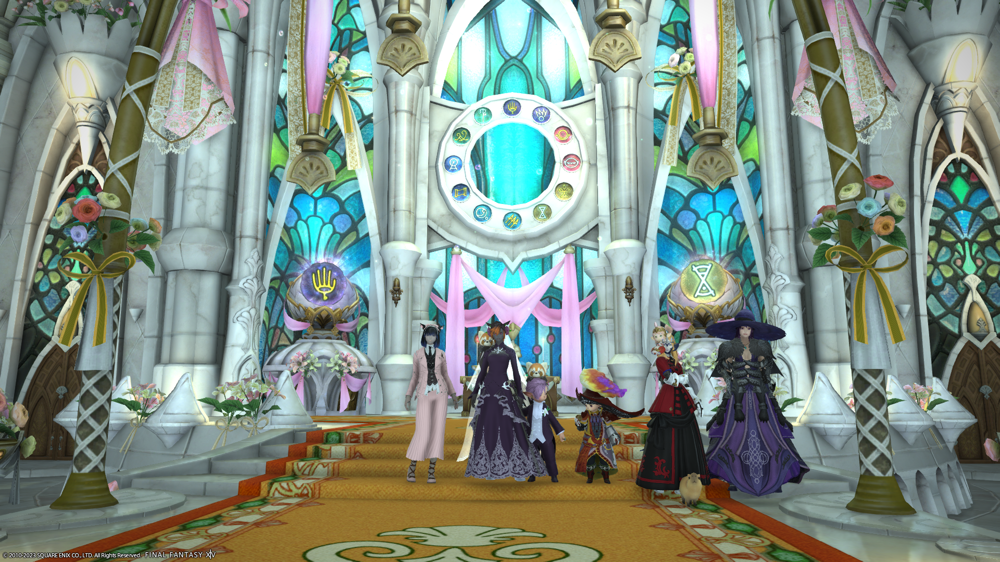
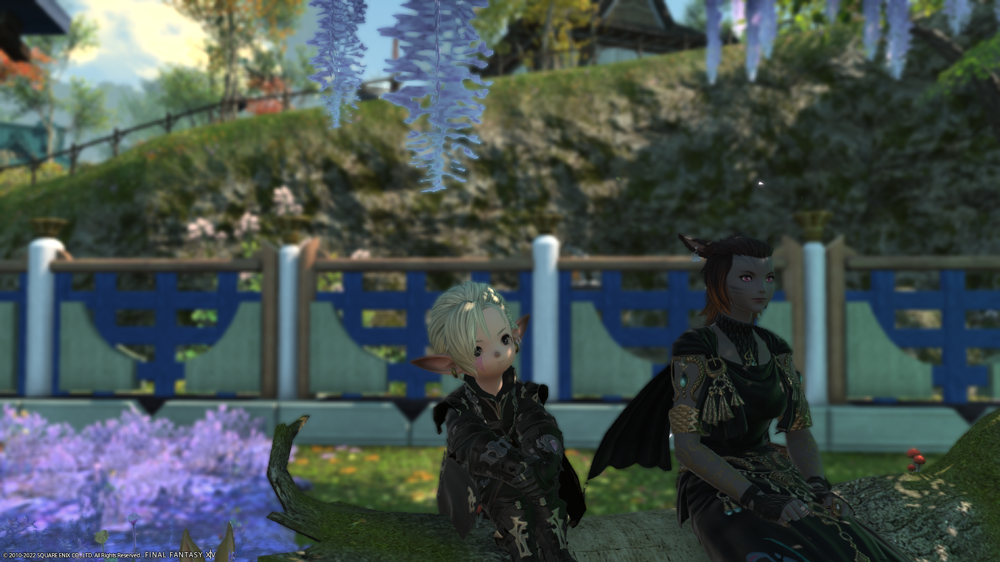
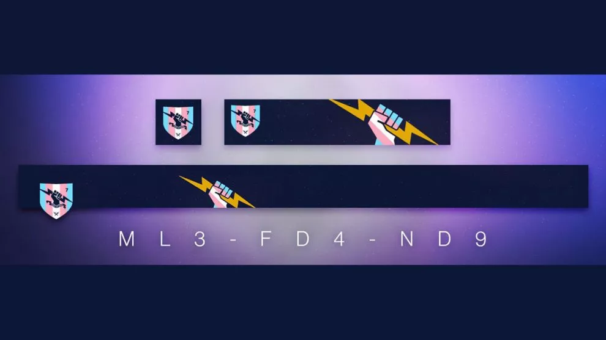

> What's the thing that sparked you to become trans? 
> — <cite>A friend of mine over Discord</cite>

It was quite complicated. I didn't think about this since childhood like many others, I had too many problems on my plate to even think about that.
I always had girl-ish manners, like crossing legs while sitting down, for me it's natural.

I think the first realisation I could even be trans was around 2018, back when I started playing ff14. I used to run a generic fem character "for trolling", ended up remaking that char for a more personal one (this char is the one as my pfp).
At this time, I spent *a lot* of time on this game, like I was 24/7 on it when I could : back from high school -> ff14 -> sleep was my weekly schedule.

 

Got dragged into roleplayers (I know, everyone made mistakes in their life), ended up in my first gay relationship (or just relationship at this point, since I was afraid of womens till 18-19yo) where I got invited to try other things and get out of my comfort zone. 
Don't get me wrong, it was nice!
During that time, I could experiment with a body who gradually felt just... Mine? At some point I realized, I wasn't \<deadname\>, I just became Cadenza Kestrel. 
It was me, nothing more, nothing less. 

My IRL self felt like it was fading away and was only "a mask" for living in society and offline. 

That also was the first time when I discovered my sexuality, since my partner at that time kept saying "are you okay we are both mens in a relationship?" and at some point I got angry and said something along the lines of "You could be a frying pan, I couldn't care less, I love people for *who they are*, not *what they are*."
Guess that made me bi/pan? I honestly don't care, I still live by this precept on this day.

Back to the original topic, I was just... Happy. I was experimenting with clothes, with the fact that I was identified as fem and I was just... Happy.

Several months later, I met back with my oldest friend in that game, I still consider him as my brother and wish one day 
I could see him irl.
At that time, he saw my char and flatly said "You've changed, you now look like a Limsa whore" (Limsa is one of the big 
cities in this game, where roleplayers tend to meet up and speak freely on... all kind of subjects)

His words hit me really had, it made all of my safety and comfort crumble down and shatter, at this very moment, 
I realized what was happening and I caught a glimpse that I might be trans (I might, what a dumbass I was, I was already at that time but didn't want to admit it!).  
I don't hold a grudge against him or anything, he knew me beforehand and was simply worried about what is happening 
(also the roleplayers tend to have quite a reputation on this game, to the point that there's a tag RP ingame for these players.)
In truth, he's one of the first people I called on phone when I announced that my name change application (irl) has been validated.

I wasn't ready at that time, I was still in my family's mind constuct of lies from a french far-right perspective with some kind of internalized LGBT-phobia, so naturally, I entered a phase of denial.

During that phase, I was trying my best to affirm myself "as a man".
I wasn't even remembering the fact that I could be trans since I did my best to just take these thoughts and memories and bury them under the carpet and pray for the best (spoiler alert, it never ends well).

I tried, I did let my beard grow, got a girlfriend, started to get more clothes and some fancy ones (damn those overcoats were hot).

Eventually, along the years the shell started to crack, very slowly though.

In 2020-2021, my best friend and some of my friends, even my gf at that time decided to try ff14, so I had to come back to this game. I hesitated for a long time to recreate a character and forget what happened. In the end I didn't have the courage 'cause it would mean erasing 1400hrs of gameplay made *in a single year*. It was to note that these friends weren't aware of what happened in 2018, I disappeared from my friend circle for a whole year because of this game.

So, we came back to this game, we played, it made me comfortable again to play as Cadenza.
And again, without me noticing, the egg was starting to slowly crack.

After this, I played Sea of Thieves with my best friend, we met some of the best people out there 💜 even though one of them called my char "Hagrid the trans cow", it was a private joke but the source of it was that even though my character was an old, fat man, I made them wear dresses. I liked them, to be honest.

After that, we played Destiny 2. It was some "normal gameplay", where I played a fem robot but what struck me the most was a question I asked my friends without even thinking about it: 
"Guys, would it be weird for me to bear the trans banner? I'm not but I feel like we should support the cause", ofc they reacted against it but it stayed stuck in my mind.

At that time, my twitter timeline was starting to fill with transgender people without really knowing why.

Later, I moved out, around spring 2023.

Around a month later, one of my homies's egg cracked so she announced to us she was starting a transition. I felt happy for her! She's awesome and I always admired her since I met her in high school, so of course I was happy for her!

As a side effect, it made me start thinking again about questioning my own gender but not entirely, it was more like lazy thinking coated in denial.
Around a trimester later I told someone I was feeling "something along the lines of gender fluidity but can't put a word on it, it's weird".

Later, my homie, after an evening of talking, said while leaving "you're gonna hate me, but I'm sending you a link, you should probably read it".
That link was https://genderdysphoria.fyi/

At first, I was like "oh, cool! Some reading so I could understand her better!"
And I started reading it avidly, and read everything in 48hrs (my sleep took a deep hit because of this).

It was all fun and games until a specific passage came up:

> Many trans people have no idea how much pain they are in until they find small bits of relief. Cosplay, stage acting, drag, role playing games, video games; small little forays into a different gender than they have lived as. They find that it feels just a little bit more comfortable. They’ll make up excuses for why (“If I’m gonna be looking at this character’s ass, it might as well be a girl’s ass.”), they’ll try to convince themselves it’s all just for fun, or an artistic expression. They might tell themselves that the bits of joy they feel at hearing a different pronoun are just novelty. But soon they find themselves looking for reasons to get that more often. More and more frequently they’re role playing characters of a different sex, building more costumes, buying more clothes, performing more often. You find yourself wanting to do that all the time, because it just feels better than your real life, and being “you” starts to hurt. Eventually, the old you becomes the costume. 
> — <cite>https://genderdysphoria.fyi/en/euphoria</cite>

And at this point, I was ***Oh.*** and I felt that in one single paragraph, everything that I tried to hide so hard went back in my face at full-force.

Afterwards, I spent a few months experimenting with myself, trying to paint my nails, trying to change my air, thinking about other things.
Then, there was *that* evening.

I was playing ff14, again, then I broke down out of nowhere.

I've never been a writer, but I started writing at that time, I kept a journal for a while, now I barely write anymore. In that journal I wrote what I was feeling that particular day.

That first entry was just an image (with the caption "Y tho") and the head title was "Why am I like this? Why can't I be "normal" for once?

I had to re-read it today to synthetize things, most of it has been written here, then there's things that I rediscovered, like the fact that at 14-15yo, I went for a hot chocolate at a friend's home and we were debating about "what is normal" and that I felt like I didn't belong in society. I was definitely too young to have a real answer/opinion but the facts are still here.

On this day, it was official, I *am* Astrid Cadenza Kestrel. (on a funny note, it makes a TCP flag :^)
That was on 2023-09-27 🏳️‍⚧️

After nearly a year, I can safely say that accepting these feelings and starting to become myself was the best choice in my life!
