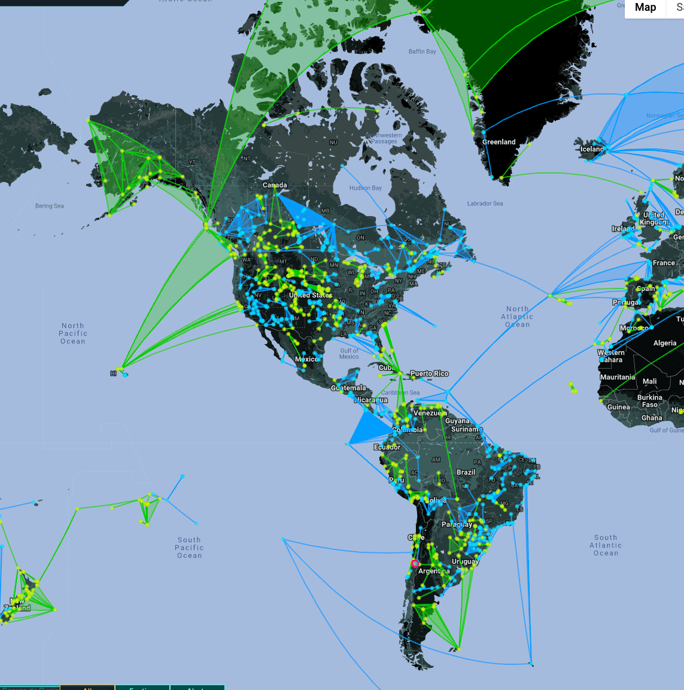
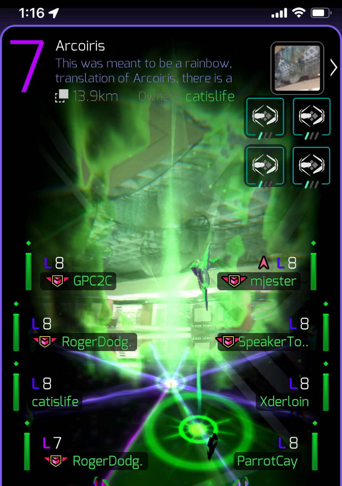
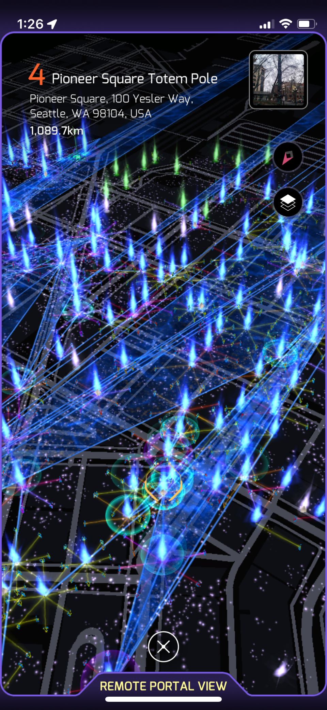
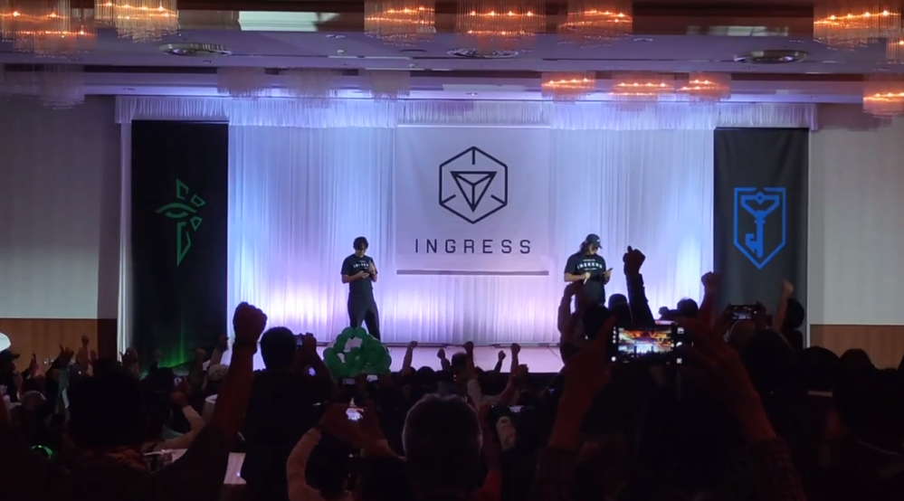

# Introduction

I'm having some kind of blues.

I love a game since it came out in 2013.
I forgot about it for a long time then finally got my hands to it by the start of this month.

# What is Ingress?

First, _no this isn't about Kubernetes's Ingress controllers_.  
The only reason I'd talk about Kubernetes here would be about the release of [UwUbernetes](https://kubernetes.io/blog/2024/04/17/kubernetes-v1-30-release/) announced at KubeCon Paris last year.

Ingress is a game, specifically, it is the grandfather, the incubator, the origin of Pokemon Go.

In comparison to PokeGo, Ingress is a large scale pvp game with an intricate lore.  
The game evolves as the players evolve too through challenges, conquest and faction-related events.

The game loop is simple, you collect _exotic matter_ (XM) through _POIs_ in cities with your phone's gps repurposed as a "_scanner_".

With this matter you either build around these POIs (aka _portals_ in game) or destroy them to rebuild on top.

Afterward, you make links to other portals in order to build triangles which give score at an international level.

There are two player factions:
- The Enlightened which wants to show XM to the masses and let everyone use it freely
- The Resistance which objectives are to hide this matter until they can harness it safely

# The playerbase

Of course, these factions are "Enemies" but can ally each other for special occasions.

On top of this day to day attrition war there are events: big meetups originally organized by NianticLabs (A.K.A. NIA) around some kind of events.

Later more of these events were organised by the community, for the community.

This game has been around twelve years.  
I did the tutorial back then I was a child and three weeks ago I found out that I had a lv 3 account lying around since then.

Back then, I got the weekly news of the game in my gmail (google game, google account and google mails). I was amazed by everything that happened! From the player events to the Big Fields Operations that happened.  
The truth is, I wanted to play this game so badly but neither my phone nor my data plan could handle this. (I used a Galaxy Gio back then with a 50Mb data plan!)

Now I'm fully in this game.  
Don't get me wrong, I love it! But there's some bitterness in all of this sweetness,  
The blood of this game is drying. 

My local community just simply died overtime. Why? Because everyone left so the community lead there did the same after five years of service for everyone.

There's also the fact that Ingress is poorly supported, the main app, the Scanner, is quite buggy when there's several actions at the same time!

And on top of that, it feels like Niantic uses Ingress as a test lab for the other games or projects.

On the opposite, we can clearly *feel* the devs love for this project, the original Google I/O talk from 2013 is a goldmine!



There's also the fact that NIA held a massive event in Hakodate (in Japan, where the player base is the most dense).

And finally, there's the Ingress Anime, in 2018, back when Ingress Prime launched, the visual overhaul and lore reboot.

The Anime feels like a nice touch with attention to the details.

What struck the most about it for me was the ending, the song and the visuals tore me down.
Most of the song is accompanied by a spinning globe of blue and green "cards" either showcasing pictures of various meetups that happened in the world since the launch. 
There are also Agent Biocards with photos of Agents and nicknames or Full names of they have the NIA logo.

You can check it out by yourself here:


The thing about it is the general feeling that I, as a player and a community member, arrived too late to the party.  
The gramps have left, the plates are half-empty but there's goodwill from the people still there.

For now, I have enlisted for the next Anomaly in Spain, we'll see how it goes? The global faction planning website announces
394 registered Enlightened players.

I also want to revitalize this game in my community, the game is so stale that in my first week, the only players we saw were from the enemy team, 
to the point where it was _that_ lonely that we ended up at a bar, all four of us.

> Cover pic from "Ingress the Animation"

> Pictures through the article are from [Ingress PR](https://ingress.com)