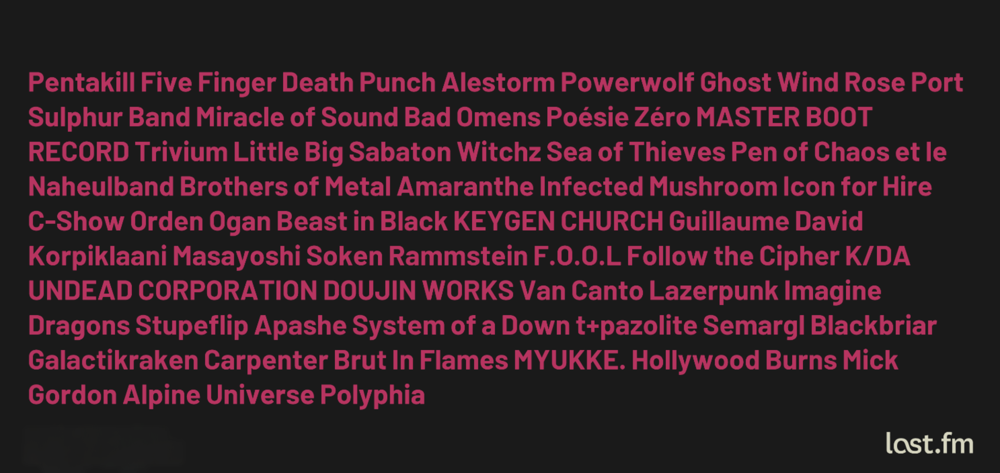

I am kind of autistic, am I?  
I can't bear _the noise_ outside like, people chatting in a cafeteria, tramways, 
chatters in bars, repetitive sounds, crying childs, and many others.

But somehow, my way to isolate myself is to enter a bubble of my own creation, 
a space made from only my trusty headset, with the help of music and good noice cancellation.

How can isolating yourself from noise by coming into another bubble of noise helps?
I have no fucking idea. Maybe again some kind of _control_ over my own life.

Having control of everything in my life is my way to deal with it and 
having things that I don't control gives me a high sense a distress.  
Another example is getting stabbed (for medical purposes), I _need_ to watch
what is happening to me and the only reason why is that by getting the visual
cues, I struggle to keep the bare minimum of control needed to stay sane.

This self made noise is usually messy, but still in tune with my mood.  
Back in 2018, I started using Spotify. There's better services out there but that's what stuck with me.  
I started back then to broaden my musical field of knowledge. 
To this day, I discovered a lot! I also went to some concerts and found some friendhships through music!

I started making playlists organized around some themes or moods.  
I'm having a bad day? There's a playlist to cope with that.  
Feeling fantasy? Another playlist.  
Wanna hear from a specific style? No problems, just take a randomly generated playlist.

Going through concerts made me discover two things:
- Big ones hurts me
- Small ones with a united crowd is a blast

There is one specific concert that I loved, went there years ago with my best friend,
Spent the night there, singing with the crowd. 
That's where I discovered that I like masses of people singing together.  
This feeling of a strong connection, all living under the same banner, the same flag,
living our best life, singing our lives away for a night

You don't see what I mean? Here's some examples (⚠️ beware, spotify previews are usually loud af)
<iframe style="border-radius:12px" src="https://open.spotify.com/embed/track/0Y3RJZq1PwB2HNYfmyEIMg?utm_source=generator" width="100%" height="152" frameBorder="0" allowfullscreen="" allow="autoplay; clipboard-write; encrypted-media; fullscreen; picture-in-picture" loading="lazy"></iframe>
<iframe style="border-radius:12px" src="https://open.spotify.com/embed/track/3LnGZ1srIqrURgYPFWKYLC?utm_source=generator" width="100%" height="152" frameBorder="0" allowfullscreen="" allow="autoplay; clipboard-write; encrypted-media; fullscreen; picture-in-picture" loading="lazy"></iframe>
<iframe style="border-radius:12px" src="https://open.spotify.com/embed/track/51iJXrmuuiLeHIVkEtwZ2p?utm_source=generator" width="100%" height="152" frameBorder="0" allowfullscreen="" allow="autoplay; clipboard-write; encrypted-media; fullscreen; picture-in-picture" loading="lazy"></iframe>

I wasn't one to sing loudly, I've always been self-conscious about my voice and for multiple reasons.  
Back when I went into my first concert, that was the first time my best friend heard me sing.

These days, I'm more open about singing, even sometimes dancing? Who knows?
I feel less restraints so I'm growing out of what was preventing me to try.

Liking music, trying new things made me broaden my horizons, made me go to concerts and I don't intend to stop here.

On a side, because I'm a nerd, I've been using [last.fm](https://last.fm) to gather data and more analytics on my tastes,
my habits and obsessions.  
It's sort of a diary. Profiles are public but I don't really feel like sharing that one :\)  
The only thing I'll allow to share is _this wall_, the top 50 of the artists I listen to the most since 2019.

In the end, Music is a signal, and I'm in love with that one.  
One of the few that don't make me feel like crap.  
Thank you 💜